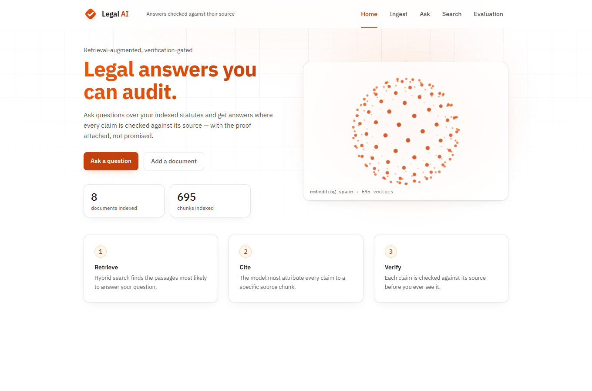
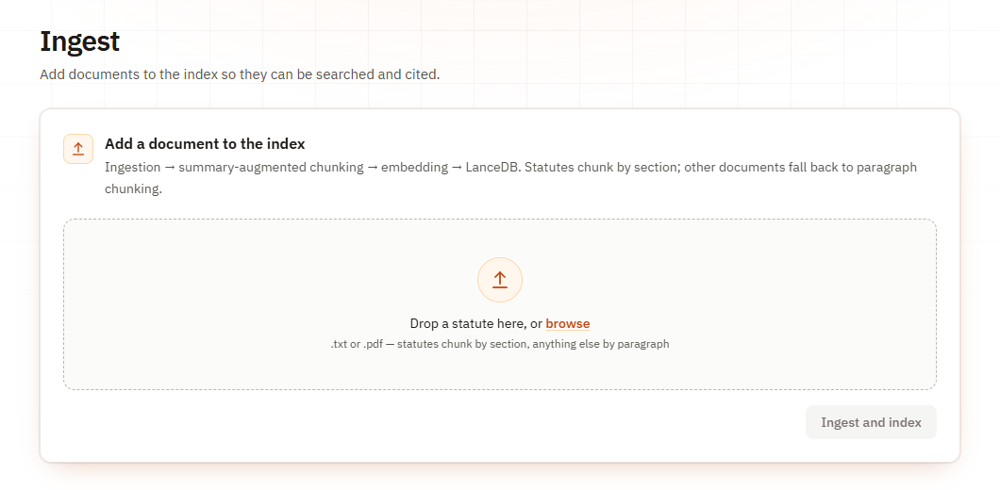
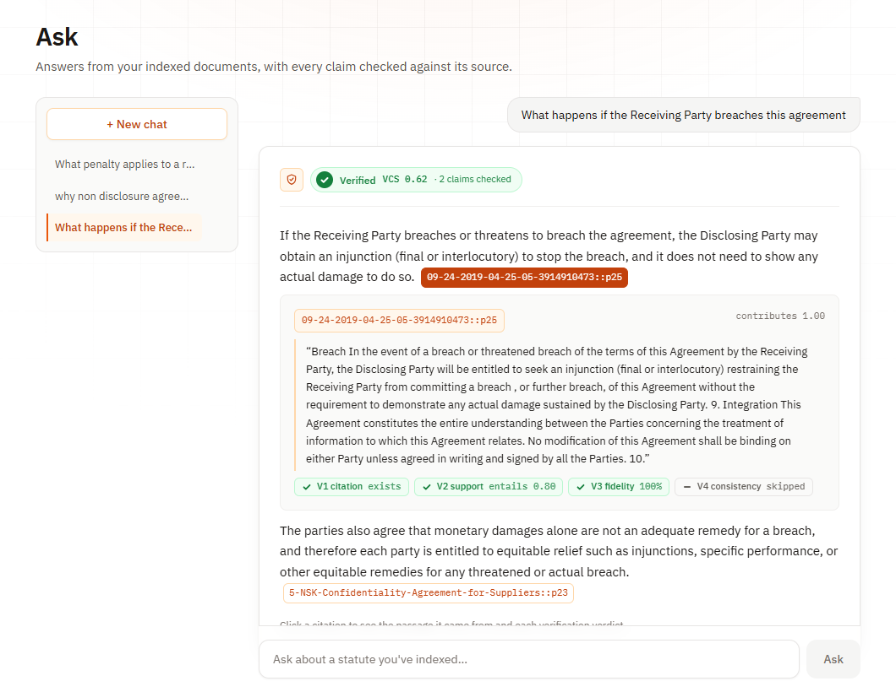
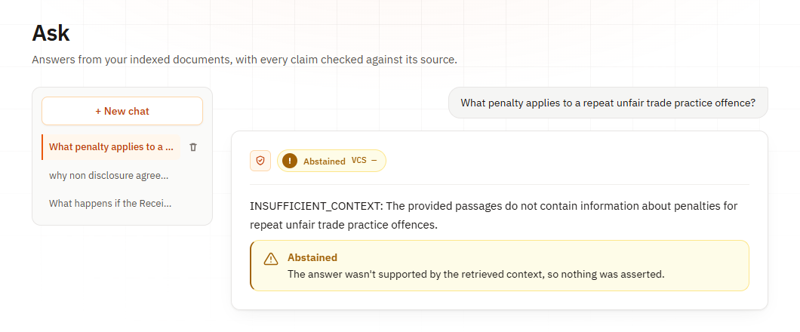
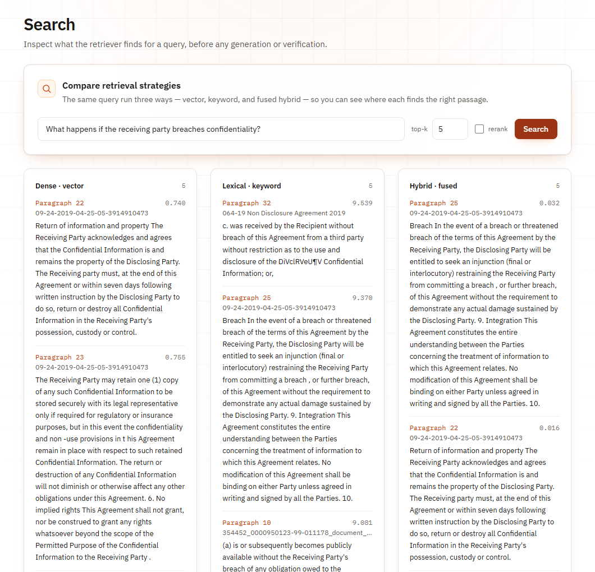
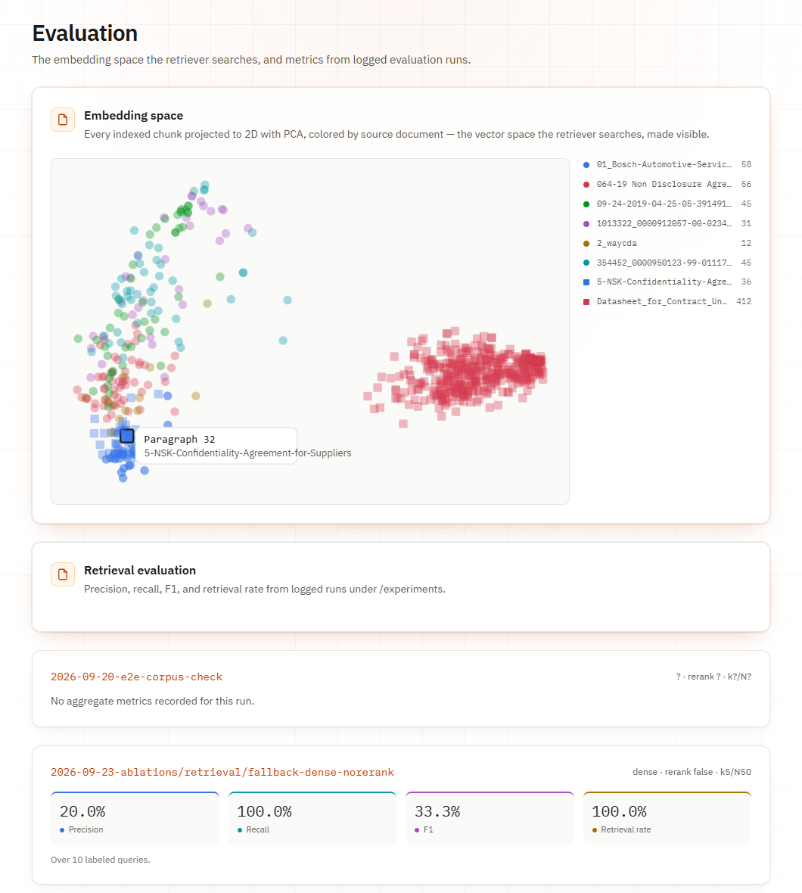
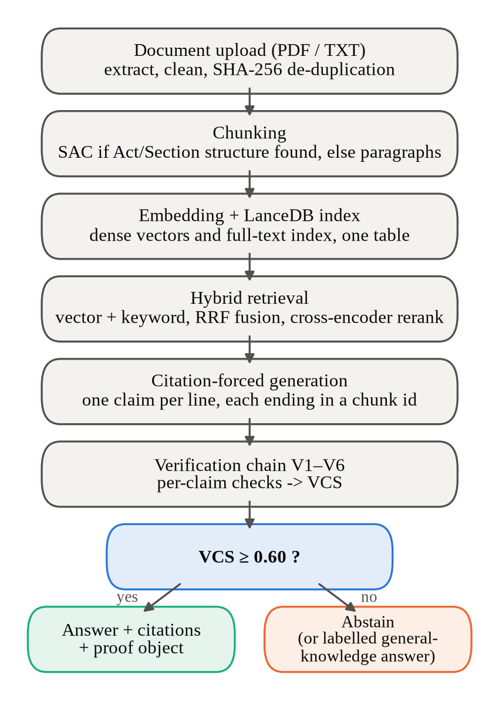
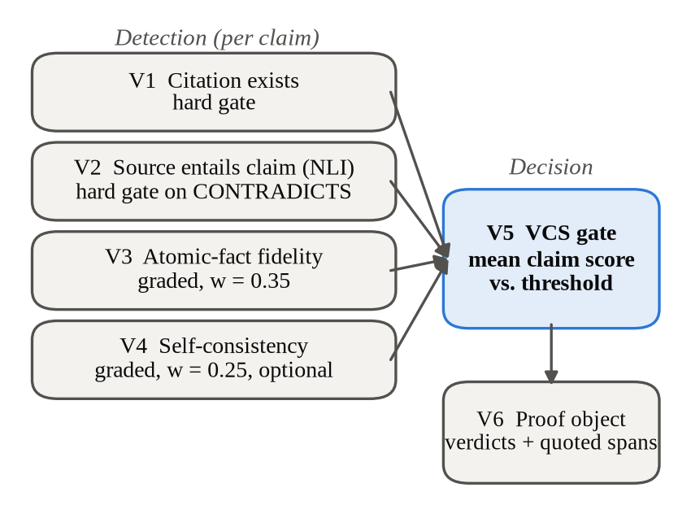

# Legal AI: System Guide

Legal AI answers questions about legal documents, such as statutes and contracts. It
checks every sentence of its answer against the passage it cites before showing it.
If the check fails, the system says it cannot answer instead of guessing.

This guide covers what makes the system different, what each page of the web app does,
the step-by-step workflows behind them, and every algorithm used, with the file that
implements it.

---

## 1. What makes it different

Most legal chatbots, including ones built on retrieval-augmented generation (RAG),
fetch some passages and let the model write an answer. Nothing checks that answer
before the user reads it. Legal AI adds that check and makes it visible.

| | Typical RAG chatbot | Legal AI |
|---|---|---|
| Citations | Optional, often invented | Required on every claim; a citation to a passage that was not retrieved scores zero |
| Checking the answer | None | Four detectors check each claim against its source (V1–V4) |
| Deciding to answer | Always answers | Answers only if the Verification Confidence Score (VCS) is at least 0.60, otherwise abstains |
| Evidence for the user | A link at best | A proof for every claim: quoted passage, each check's verdict, the claim's score |
| General questions ("what is an NDA?") | Mixed in with sourced answers | Answered separately and labelled *general knowledge*, with no citations or score |
| Chunking | Fixed-size windows | Split by section and clause for statutes, by paragraph for anything else |
| Infrastructure | Vector database server | One embedded LanceDB folder on disk, with no server |
| Model lock-in | One provider | Claude, OpenAI, Gemini or Groq, chosen with one environment variable |
| Framework | The framework decides what you can check | LangChain handles loading, retrieval and generation; the verification chain is our own code, and a plain-Python reference implementation gives identical results |

**What the measurements show** (all logged under `/experiments`):

- We corrupted 28 claims on purpose, with fake citations and swapped claims. The full
  chain showed **none** of them to the user.
- Removing any single detector still showed none, because the detectors overlap.
  Removing the **score gate (V5)** showed **all 28**. The gate is what protects the
  user, not any one detector.
- Structure-aware chunking (SAC) raised retrieval F1 from **0.333 to 0.417** over
  paragraph chunking, and sent the model about a third of the text.
- In an end-to-end test through the web app, with 5 real documents and 15 questions
  whose answers were written down first, **no wrong answer was shown as Verified**.
  The main failure was refusing answerable questions (4 of 15), and two of those
  were parser bugs that are now fixed (`experiments/2026-09-24-human-e2e/`).

---

## 2. The pages

The web app (React + Vite + Tailwind) has five pages. Every page calls the FastAPI
backend, and everything a page shows is also available as an API call. By default the
app talks to the LangChain backend on port 8001 (`web/.env`). The plain-Python
reference backend serves the same endpoints on port 8000.

### 2.1 Home



**What you see:**

- The headline and two buttons, *Ask a question* and *Add a document*.
- Two counters: documents indexed and chunks indexed.
- The three steps of the system: Retrieve, Cite, Verify.

**Behind it:**

- The counters come from `GET /stats`, which counts rows in the LanceDB table
  (`src/api/index_stats.py`).
- The rotating point cloud is decorative, drawn on a canvas with no 3D library. The
  vector count under it is the real chunk count.

### 2.2 Ingest



**What you see:** a drop zone for a `.txt` or `.pdf` file and an *Ingest and index*
button. After upload, the page shows:

- how many chunks were created;
- whether the file was split by legal structure (SAC) or fell back to paragraphs;
- the chunks themselves.

**Behind it** (`POST /ingest`, `src/api/routes/ingest.py`):

1. The file's bytes are hashed with SHA-256. If the same content or the same file
   name is already indexed, the server answers **409**. The page then offers
   **Replace existing document**, which calls `DELETE /documents/{source_id}` and
   uploads again.
2. The text is extracted (pypdf for PDF), cleaned and parsed for
   Act → Chapter → Section → Clause structure.
3. If there is structure, the document is split with summary-augmented chunking.
   Otherwise it is split by paragraph.
4. Each chunk is embedded and added to LanceDB, and the keyword index is rebuilt.

Each failure returns its own clear error:

| Code | Cause |
|---|---|
| 415 | Unsupported file type |
| 422 | Empty file |
| 503 | Embedding model unavailable |
| 500 | Index write failed |

### 2.3 Ask



**What you see:**

- A chat on the right and saved conversations on the left.
- Each answer carries a badge:
    - **Verified**: green, with the VCS and the number of claims checked.
    - **Abstained**: amber.
    - **General knowledge**: violet.
- Every claim ends in a citation chip. Clicking the chip opens the **proof**:
    - the quoted source passage;
    - a chip for each check (V1 citation exists, V2 support, V3 fidelity,
      V4 consistency);
    - how much the claim contributes to the score.



When the documents don't contain the answer, the model returns
`INSUFFICIENT_CONTEXT` and the page states plainly that nothing was asserted.

**Behind it:**

- `POST /query` runs the whole pipeline: retrieval, generation, verification, and the
  general-knowledge fallback if needed (`src/api/routes/query.py`). The page sends
  `k = 12`, reranking on, and no self-consistency resamples (V4 shows as *skipped*,
  to save API calls).
- Conversations are saved as one JSON file each under `data/chats/`
  (`src/chat/store.py`) through `GET/POST/DELETE /chats` and
  `POST /chats/{id}/messages`.

### 2.4 Search



**What you see:** one query run three ways, side by side:

- **Dense** (vector);
- **Lexical** (keyword, BM25);
- **Hybrid** (the two fused).

Each result shows its chunk, source document and score. A *rerank* checkbox adds a
fourth column reranked by the cross-encoder.

**How to read the scores:**

- **Dense** shows vector distance. Lower means closer.
- **Lexical** shows a BM25 score. Higher is better.
- **Hybrid** shows the reciprocal rank fusion (RRF) score, which is higher when a
  chunk ranks well in *both* lists. In the screenshot, *Paragraph 25* appears in both
  the dense and keyword lists and scores 0.032; chunks found by only one list score
  about 0.016.

**Behind it:** `GET /retrieve?q=…&k=…&rerank=…` (`src/api/routes/retrieve.py`). No
model generates anything here. The page exists to inspect retrieval on its own.

### 2.5 Evaluation



**What you see:**

1. **Embedding space.** Every indexed chunk is projected to 2D, with one colour and
   shape per document. Hovering a point shows which chunk it is. In the screenshot,
   the 412 chunks of the one non-agreement document form their own cluster, while
   the seven agreements overlap because they share vocabulary.
2. **Retrieval evaluation.** There is one card per logged experiment, with
   precision, recall, F1 and retrieval rate.

**Behind it:**

- `GET /embedding-map` loads every vector and projects it with PCA
  (`src/api/projection.py`).
- `GET /evaluation` walks `experiments/` and reads each run's `config.json` and
  `results.json` (`src/evaluation/results_store.py`).
- Verification-ablation runs store their results in a different format, so their
  cards currently say *No aggregate metrics*. Their numbers are in the paper and in
  `experiments/2026-09-23-ablations/verification/results.json`.

---

## 3. Workflows



### Where the code lives

The pipeline exists twice, and both versions give the same results:

- **`lc/`**, the default. Loading, retrieval and generation are built from LangChain parts.
- **`src/`**, the plain-Python reference implementation. It also holds the code that
  LangChain has no equivalent for (the SAC section parser and the V1–V6 verification
  chain), and `lc/` calls that code directly.

| Stage | LangChain (`lc/`) | Reference (`src/`) |
|---|---|---|
| Loading | `loaders.py`: TextLoader, plus a page-joining PDF loader | `ingestion/loaders.py` |
| Chunking | `splitters.py`: custom TextSplitters around the SAC parser | `chunking/sac.py`, `fallback.py` |
| Embeddings | `embeddings.py`: HuggingFaceEmbeddings | `embedding/sentence_transformer.py` |
| Index | `vectorstore.py`: LanceDB vector store, own folder `data/lancedb_lc` | `indexing/build.py` |
| Retrieval | `retrieval.py`: EnsembleRetriever (dense + BM25, RRF) → CrossEncoderReranker | `retrieval/retriever.py`, `rerank.py` |
| Generation | `generation.py`: ChatPromptTemplate → chat model → citation parser (LCEL) | `generation/` |
| Verification | `verification.py`: V1–V6 wrapped as Runnables | `verification/` |
| Whole pipeline | `pipeline.py`: one LCEL chain; `api.py` on port 8001 | `api/main.py` on port 8000 |

**The equivalence check** (`experiments/langchain_port/report.md`):

- Both versions returned the same top-5 results in the same order for all 10 labelled
  questions (F1 0.417, recall 1.00).
- On the same cached answers, they reached the same verification decisions and scores.
- Neither let any of the 28 corrupted claims through.
- Mean query time differed by 4.6%, which is within the variation of the LLM calls.

The step tables below name the `src/` files, because they hold the algorithm itself;
the matching `lc/` file for each stage is in the table above.

### 3.1 Adding a document

| Step | What happens | Code |
|---|---|---|
| 1 | Read the upload and hash it with SHA-256; refuse duplicates (409) | `src/indexing/dedup.py` |
| 2 | Extract text: plain read for `.txt`, pypdf for `.pdf` | `src/ingestion/loaders.py` |
| 3 | Clean whitespace without touching headings | `src/ingestion/cleaning.py` |
| 4 | Parse Act / Chapter / Section / Clause | `src/ingestion/structure.py` |
| 5 | Chunk: SAC if structure was found, else paragraph fallback | `src/chunking/sac.py`, `src/chunking/fallback.py` |
| 6 | Embed "summary + chunk text" with all-MiniLM-L6-v2 | `src/indexing/build.py`, `src/embedding/` |
| 7 | Append rows to LanceDB and rebuild the keyword (FTS) index | `src/indexing/build.py` |

The file name (without extension, trimmed) becomes the `source_id`, and every chunk id
starts with it:

- SAC ids look like `tenancy_act::s4:b` (Section 4, Clause b).
- Fallback ids look like `contract::p25` (Paragraph 25).

### 3.2 Asking a question

| Step | What happens | Code |
|---|---|---|
| 1 | Fetch a deep candidate pool (at least 100) with hybrid search | `src/retrieval/retriever.py` |
| 2 | Rerank the pool with the cross-encoder and keep the top *k* (12 in the UI) | `src/retrieval/rerank.py` |
| 3 | Build the prompt: only these passages; one claim per line; every line ends in `[chunk_id]`; or reply `INSUFFICIENT_CONTEXT` | `src/generation/prompt.py` |
| 4 | Call the chosen LLM through its adapter | `src/generation/adapters/`, `factory.py` |
| 5 | Parse the reply into claims and their cited ids | `src/generation/parser.py` |
| 6 | Run the verification chain V1–V6 | `src/verification/chain.py` |
| 7 | If VCS ≥ 0.60, the answer is **Verified**; otherwise **Abstained** | `src/verification/v5_vcs.py` |
| 8 | If declined *and* the question is a general concept question, answer from model knowledge, labelled as unverified | `src/generation/general_knowledge.py` |

### 3.3 Verifying an answer (V1–V6)



| Layer | Question it answers | How | Effect |
|---|---|---|---|
| **V1** Citation existence | Was the cited chunk actually retrieved? | Set membership against the retrieved ids | Fail → claim score 0 (hard gate) |
| **V2** Entailment | Does the cited passage support the claim? | NLI with roberta-large-mnli: passage = premise, claim = hypothesis | ENTAILS → 1, NEUTRAL → 0, CONTRADICTS → claim score 0 (hard gate) |
| **V3** Atomic fidelity | Is every part of the claim supported? | Split the claim into small facts; NLI on each; fraction entailed | 0 to 1, weight 0.35 |
| **V4** Self-consistency | Does the claim come back if we ask again? | Regenerate N times; match claims by word overlap | 0 to 1, weight 0.25 (optional) |
| **V5** VCS gate | Is the whole answer trustworthy enough? | Weighted score per claim, averaged, compared to τ = 0.60 | ANSWER or ABSTAIN |
| **V6** Proof object | What is the evidence? | Records each claim, cited ids, quoted passage, verdicts, score | Shown when a citation is clicked |

**Claim score:**

```
if V1 failed or V2 = CONTRADICTS:   s = 0
else:  s = (0.40·e + 0.35·f + 0.25·c) / (sum of the weights of the layers that ran)
```

`e` = 1 if V2 says ENTAILS, else 0; `f` = V3 fidelity; `c` = V4 consistency. A layer
that did not run is removed from both the top and the bottom of the fraction, so
skipping V4 never lowers a score.

**Answer score:** VCS = the average of the claim scores. The answer is shown if
VCS ≥ 0.60.

**Worked example** (the Ask screenshot):

- The first claim has V1 exists, V2 entails, V3 fidelity 100% and V4 skipped. Its
  score is (0.40·1 + 0.35·1) / (0.40 + 0.35) = **1.00**.
- The answer's VCS is 0.62 across two claims, so the second claim scored below 0.25.
  It was shown because it was averaged with a strong claim. This is a known weakness
  of mean aggregation (see §7).

### 3.4 Searching

`GET /retrieve` runs dense, keyword and hybrid search for the same query and returns
all of them; with `rerank=true` it adds the reranked hybrid list. It never calls the
LLM.

### 3.5 Evaluating and ablations

| Script | What it does |
|---|---|
| `python -m src.evaluation.run_retrieval_eval` | Runs labelled questions and scores precision, recall, F1 and retrieval rate. Writes `experiments/<run>/config.json` and `results.json` |
| `python -m src.evaluation.run_ablation_sweep` | Every combination of chunking (SAC / fallback), retrieval (dense / hybrid) and reranking (on / off) |
| `python -m src.evaluation.run_verification_ablation` | Generates each answer once, then replays it with one layer switched off at a time. Also runs two probes: fake citations and swapped claims |
| `python docs/paper/make_figures.py` | Redraws every paper figure from the logged files |

### 3.6 Managing documents and chats

- **Duplicate check:** same bytes (SHA-256) or same name → 409, and nothing is added.
- **Replace:** delete the old document's chunks, then upload again.
- **Delete:** `DELETE /documents/{source_id}` removes every chunk of that document
  and rebuilds the keyword index, so deleted text can't still turn up in keyword
  search.
- **Chats:** stored as one JSON file per conversation. Conversation ids are checked,
  so a crafted id can't point outside the chats folder.

---

## 4. Algorithms

| # | Algorithm | Where | How it works |
|---|---|---|---|
| 1 | Text cleaning | `ingestion/cleaning.py` | Normalise line endings, strip trailing spaces, collapse 3+ blank lines. Headings are left intact |
| 2 | Structure parsing | `ingestion/structure.py` | A line-by-line regex parser recognising `CHAPTER IV – …`, `Section 5. …`, `(1) …` and `Clause (a): …` |
| 3 | **Summary-Augmented Chunking (SAC)** | `chunking/sac.py` | One chunk per section body and one per clause. Each carries a short summary of its section (heading + first sentence), made without an LLM. The summary is embedded with the chunk, so a clause is found together with its section's context |
| 4 | Paragraph fallback chunking | `chunking/fallback.py` | Split on blank lines. A paragraph over 700 characters is split into sentences, and the sentences are packed greedily into windows of at most 700 characters |
| 5 | SHA-256 fingerprinting | `indexing/dedup.py` | A hash of the raw bytes is stored on every chunk; a matching hash or name means a duplicate |
| 6 | Sentence embeddings | `embedding/sentence_transformer.py` | all-MiniLM-L6-v2, 384 dimensions, normalised to unit length |
| 7 | BM25 keyword search | LanceDB full-text index | Scores chunks by term frequency, weighted by how rare each term is, with document-length normalisation |
| 8 | **Reciprocal Rank Fusion (RRF)** | `indexing/query.py` (LanceDB) | score(d) = Σ 1 / (60 + rank of d in each list). Rewards chunks that rank well in both dense and keyword search |
| 9 | Cross-encoder reranking | `retrieval/rerank.py` | BAAI/bge-reranker-base reads query and passage *together* and gives a relevance score. Applied to the top 100 candidates, then cut to *k* |
| 10 | Neighbour expansion | `retrieval/neighbors.py` | Adds the chunks just before and after each hit from the same document, for answers split across chunks. Off by default |
| 11 | Citation-forced prompting | `generation/prompt.py` | System rules: use only the context, one claim per line, cite every line, or reply `INSUFFICIENT_CONTEXT` |
| 12 | Claim parsing | `generation/parser.py` | Regex pulls `[id]`, `[id1][id2]` or `[id1, id2]` from each line; a line with no citation is flagged as malformed |
| 13 | Citation existence (V1) | `verification/v1_citation.py` | Every cited id must be in the set of retrieved ids |
| 14 | Natural language inference (V2) | `verification/nli.py`, `v2_entailment.py` | roberta-large-mnli labels a (passage, claim) pair ENTAILS / NEUTRAL / CONTRADICTS. With several citations, the best outcome is kept (ENTAILS beats CONTRADICTS beats NEUTRAL) |
| 15 | Atomic decomposition (V3) | `verification/v3_atomic.py` | Split the claim on `;`, " and ", " or " and sentence ends; check each part with NLI; fidelity = parts entailed ÷ parts |
| 16 | Self-consistency (V4) | `verification/v4_consistency.py` | Regenerate N answers. A claim "recurs" if a resampled claim shares ≥ 50% of its words (token Jaccard). Consistency = recurrences ÷ N |
| 17 | Verification Confidence Score (V5) | `verification/v5_vcs.py` | Hard gates, then the weighted mean per claim, the average over claims, and the threshold 0.60 (see §3.3) |
| 18 | Proof object (V6) | `verification/v6_proof.py` | For each claim, picks the cited chunk with the most word overlap as the quoted passage and stores every verdict |
| 19 | General-concept detection | `generation/general_knowledge.py` | Regex. The question must start like a definition ("what is", "define", "explain") *and* have no reference to the documents ("this agreement", "section 4", "what happens if"). Unclear cases stay on the verified path |
| 20 | PCA projection | `api/projection.py` | Centre the vectors, take the top 2 singular vectors (NumPy SVD), project onto them |
| 21 | Retrieval metrics | `evaluation/retrieval_eval.py` | P = relevant retrieved ÷ retrieved; R = relevant retrieved ÷ relevant; F1 = 2PR / (P + R); retrieval rate = share of questions with at least one gold chunk in the top *k* |

---

## 5. API

| Method | Path | Purpose |
|---|---|---|
| `POST` | `/ingest` | Upload a `.txt` / `.pdf`, chunk, embed, index |
| `DELETE` | `/documents/{source_id}` | Remove a document's chunks |
| `GET` | `/retrieve` | Dense / keyword / hybrid (/ reranked) results for a query |
| `POST` | `/query` | Full pipeline: answer + VCS + proof |
| `GET` | `/stats` | Documents and chunks indexed |
| `GET` | `/embedding-map` | 2D PCA coordinates of every chunk |
| `GET` | `/evaluation` | Logged experiment runs |
| `GET` `POST` `DELETE` | `/chats`, `/chats/{id}`, `/chats/{id}/messages` | Conversation history |
| `GET` | `/health` | Liveness check |

## 6. Technology

| Part | Choice |
|---|---|
| Backend | Python, FastAPI |
| Orchestration | LangChain (`lc/`, default); plain-Python reference in `src/` |
| Index | LanceDB (embedded; vectors + BM25 in one on-disk table) |
| Embeddings | sentence-transformers/all-MiniLM-L6-v2 |
| Reranker | BAAI/bge-reranker-base (cross-encoder) |
| Entailment | roberta-large-mnli (Hugging Face Transformers) |
| Generation | Claude, OpenAI, Gemini or Groq via adapters (`LLM_PROVIDER`) |
| PDF | pypdf |
| Frontend | React, Vite, Tailwind CSS, Framer Motion |
| Tests | pytest (unit tests use stub models, so no downloads or API keys are needed) |

## 7. Limitations

- **Small test set:** ten labelled questions over five synthetic statutes. Every
  retrieval setting found a gold clause for every question, so the set can't rank
  retrieval methods.
- **Threshold not tuned:** τ = 0.60 is a default. Three of ten answerable questions
  were refused because the NLI model said NEUTRAL on correct citations.
- **Mean aggregation:** a weak claim can pass next to a strong one (the §3.3 example).
  Gating each claim separately would fix this.
- **General-domain NLI:** roberta-large-mnli was not trained on legal text.
- **`langchain-community` is being wound down** by its maintainers. The LangChain
  version takes its loader, LanceDB store, BM25 retriever and cross-encoder wrapper
  from that package, so they will need moving to standalone packages.
- **Comparison questions:** one retrieval pool serves the whole question, so one
  document can crowd out another. The model's "not found" note has no citation and is
  dropped, so an incomplete answer can look complete.
- **Names outside the cited clause:** the NLI check can say NEUTRAL when a claim names a
  party that appears only in the agreement's heading, not in the cited clause.
- **Missing pieces:**
    - HTML files can't be ingested yet.
    - The Evaluation page doesn't show verification-ablation runs.
    - Reranking adds several seconds per question.
